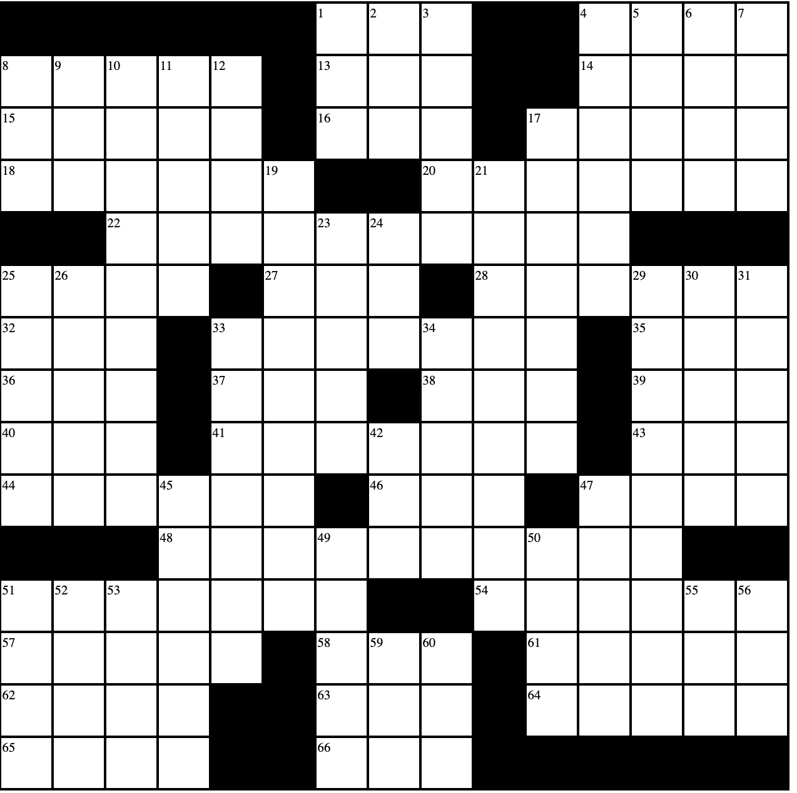

# Crossword Builder 
## (Under Construction)

View live on Github Pages [here](https://zalmankelber.github.io/Crossword-Tool/)

## Basic Description

Built in plain JavaScript (without ES6 modules) in order to allow for simple deployment on Github Pages.  Users can build a crossword puzzle template between size 3x3 and 55x55.  When a square is filled in or reopened, DOWN and ACROSS numbers are relabeled.  The following rules are enforced:

* Grid length must be odd

* Grid must have 180 degree rotational symmetry (enforced automatically when an individual square is toggled)

* Every square must be part of a vertical and horizontal answer

* Every answer must be at least three letters long

* All words must be connected (TO DO)

* (Unofficial rule): No side of the grid may be completely filled in (TO DO)

Once the user is satisfied with their grid arrangement, they can finalize it, at which point the individual squares become editable to allow for text to be entered

# Software Engineering Crossword Puzzle

By Alex Kelber (apologies for impossibly obscure clues and outrageously bad puns)

 

ACROSS   
1 \_\_\_ Mahal  
4 Section or page, to Johann   
8 1990s Wes. Hemisphere treaty   
13 "Eureka!"     
14 Soviet gymnast Korbut   
15 Acronym for largest Rosicrucian organization    
16 Social media reaction, often   
17 Reddish-Brown earth pigment   
18 In favor of radically mobilizing poor rural workers, for example   
20 Kazakhstan capital (old spelling)    
**22 “The floor is a programming language!”**  
25 Psych. disorder that follows catastrophic events   
27 \_\_\_ de Janeiro   
28 Written command from a judge (abbr.)   
32 Decompose   
33 Ovular   
35 with 5 DOWN, "Able was I \_\_\_ I saw \_\_\_\_"   
36 9th century Frankish Queen   
37 \_\_\_DAS (acronym for order of mathematical operations)  
38 Single \_\_\_ (disposable)  
39 Archaeological site   
40 Letters preceding D in avbody that includes many first world nations 
41 Grand Central or Penn   
43 Sch. founded by Thomas Jefferson    
44 Radio Channel owned by Washington State’s Mercer Island School District   
46 Frequent second or last word in twitter bios   
47 Triple \_\_\_\_ (demanding figure skating jump)  
**48 Woodwind for building web UI’s?**  
51 Purple-colored sash worn with a kimono, perhaps   
54 Blood plasmas   
57 Japanse noodle soup   
58 Ponytail alternative   
61 Miyazaki film   
62 Sports ntwrk.   
63 Fourteenth letters   
64 Members of a Yoruban ethnic group in Nigeria   
65 Mexican currency   
66 Its varieties include Black, Green and Oolong   
   
DOWN   
   
1 "\_\_\_\, you’re it!"  
2 Tuna variety in Japanese cuisine   
3 Alladin villain   
4 Caprese salad ingredient    
5 See 35 ACROSS   
6 "When will \_\_\_\_ what I’m owed?"   
7 Wife of Eric Trump   
8 Viet \_\_\_  
9 Reddit Q & A letters   
**10 “Ship of web applications!”**  
11 Major chord, e.g. \_\_\_\_\_  
12 ".txt isn’t optimal.  Put the data in \_\_\_\_ file" 
17 Number of times a repetitive task must be completed, say   
**19 Place to push commits with a bull’s eye?**  
**21 Algorithms for ordering ice cream cones, maybe?**   
23 Letter after Rho   
24 Cntrprt. to row   
25 Conclusive evidence   
26 \_\_\_\_\_ Pole (Monumental carving in Indigenous cultures of the Pacific Northwest)  
**29 Middleware that might work with React-Grunge?**  
30 Operate an automobile   
31 Monarchical    
33 Letter after Delta   
34 "The top with cannopie of greene was spred/Thicken’d with leaues of th\’\_\_\_\_\_ wanton hed"  
42 English article   
45 Mus. notation directive   
47 Brother of Moses   
49 Mountainous region of China   
50 Seized car, perhaps   
51 Chop onions prior to searing them, for example   
52 Release coherent light, as gas particles   
53 Refs   
55 Prefix meaning muscle   
56 Distress letters   
59 French article   
60 US Intel. agency   